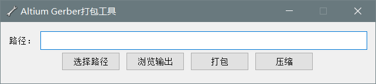
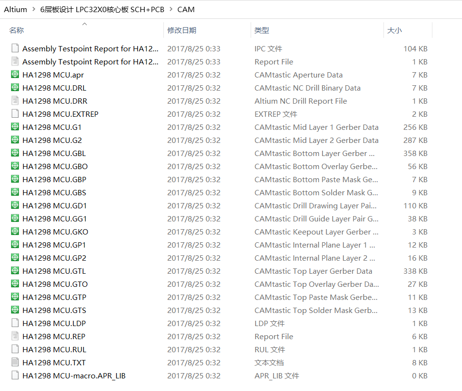
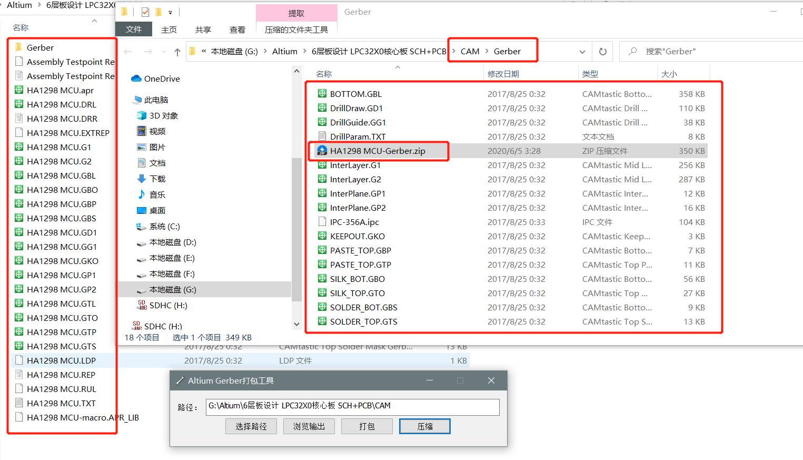

# Altium Designer后期打包工具说明

## 为什么写这样的软件

- 因为AD软件输出Gerber后所有的Gerber文件都是同名的，只能靠后缀去识别文件，不利于识别；
- 有部分的报表文件属于多余的。

## 软件界面

## 软件使用说明

1. 先选择路径，然后找到AD输出Gerber后的文件夹目录；

2. 点击打包即可在刚刚选择的路径下生成一个Gerber的文件夹，里面已经提取出来生成需要的文件；

3. 点击压缩，即可把刚刚输出的Gerber文件夹里面的所有文件压缩成zip格式。

   【备注】：默认打包完成和压缩完成后都会打开生成的Gerber文件加目录，也可以自行手动浏览。

## 使用效果

### 使用前

### 使用软件打包后

